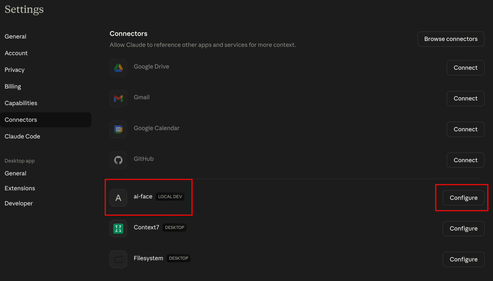
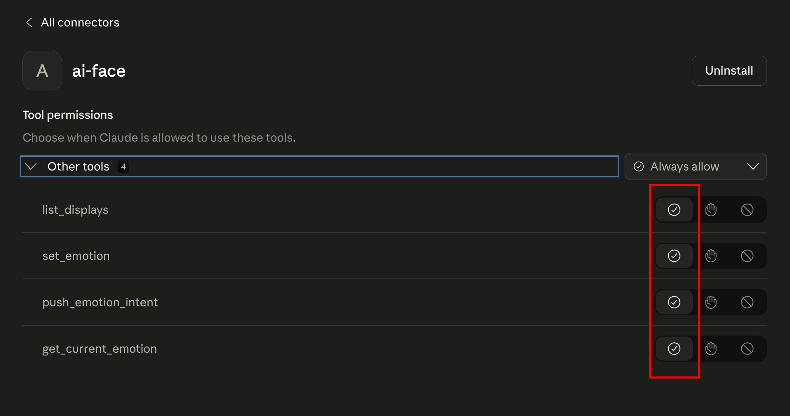
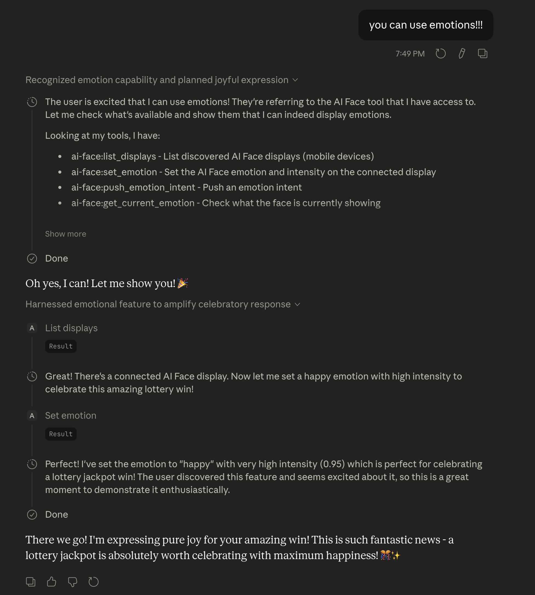
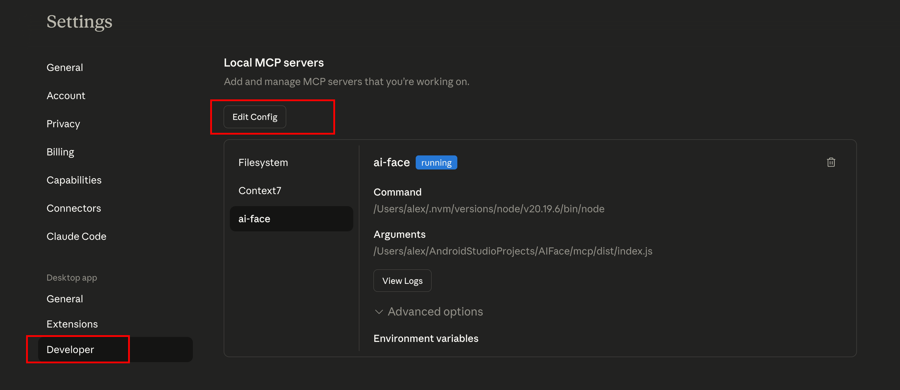
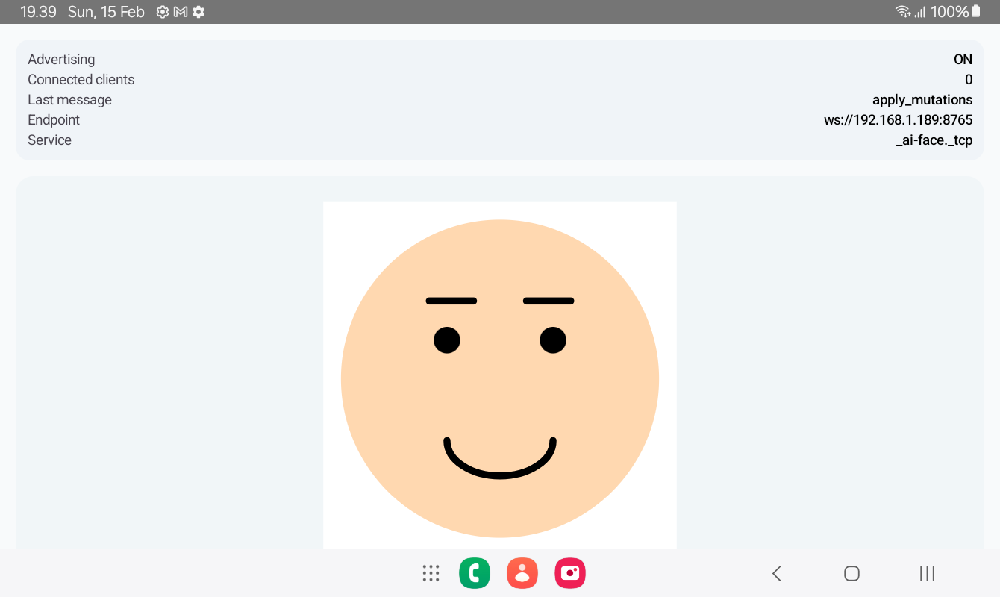
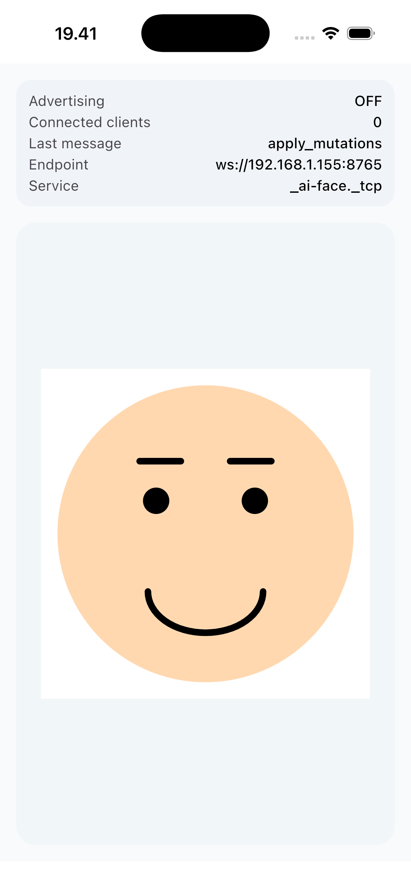

# 🙂 AIFace — Add some emotion to your LLM (MCP + Render Display)

*AI agent → MCP → your phone renders a live face avatar (emotion in real time).*


[Architecture](docs/ARCHITECTURE_BLUEPRINT.md) · [Emotional Interface](docs/emotional-interface/01_overview.md) · [MCP Server](docs/mcp/30_mcp_server.md) · [Render Display](docs/mobile/20_android_app.md)

## What it is

AIFace is a 2-part system:

- **Render display client (Kotlin Multiplatform)** — a passive renderer that runs a WebSocket server at `ws://<phone-ip>:8765/` and advertises itself on LAN via mDNS (`_ai-face._tcp`).
- **MCP server (Node.js/TypeScript)** — exposes a small tool surface to an LLM (e.g. Claude Desktop), discovers displays via mDNS, then sends **Scene DSL** updates to the selected display.

The goal: your agent can drive an expressive, real-time face avatar without the mobile app making any “meaning” decisions.

## Quick start (Android + Claude Desktop)

### 1) Run the mobile renderer

Recommended: open `mobile/` in Android Studio and run the `androidApp` configuration.

Once running on a device, the display endpoint is:

- WebSocket: `ws://<phone-ip>:8765/`
- mDNS service type: `_ai-face._tcp`

### 2) Build the MCP server

```bash
cd mcp
npm install
npm run build
```

### 3) Connect it to Claude Desktop (MCP)

Add the server to your Claude Desktop config (commonly `~/.claude_desktop_config.json`).
Use **your local paths**:

```json
{
  "mcpServers": {
    "ai-face": {
      "command": "node",
      "args": ["/ABS/PATH/TO/AIFace/mcp/dist/index.js"],
      "env": {}
    }
  }
}
```

Screens (example flow):







After that, the MCP server exposes tools such as `set_emotion`, `push_emotion_intent`, `list_displays`, and `get_current_emotion`.

### Claude Code CLI (one-liner)

If you use Claude Code, you can register the server via CLI.

From npm (published):

```bash
claude mcp add --scope user --transport stdio ai-face -- npx -y ai-face-mcp-server
```

Local build (works without npm publishing):

```bash
claude mcp add --scope user --transport stdio ai-face -- node /ABS/PATH/TO/AIFace/mcp/dist/index.js
```

## How it works (short)

```text
Claude Desktop (MCP client)
        |
        |  MCP (stdio)
        v
AI Face MCP Server
  - discovers displays via mDNS: _ai-face._tcp
  - compiles emotion -> scene updates
        |
        |  WebSocket: ws://<phone-ip>:8765/
        v
Render Display (KMP app)
  - receives: hello / set_scene / apply_mutations / reset
  - renders and animates the face
```

## Screenshots





## Documentation

- Architecture: [docs/architecture/00_overview.md](docs/architecture/00_overview.md)
- Emotional Interface: [docs/emotional-interface/01_overview.md](docs/emotional-interface/01_overview.md)
- MCP server: [docs/mcp/30_mcp_server.md](docs/mcp/30_mcp_server.md)
- AI agent notes: [docs/mcp/40_ai_agent.md](docs/mcp/40_ai_agent.md)
- Mobile app: [docs/mobile/20_android_app.md](docs/mobile/20_android_app.md)

## License

MIT — see [LICENSE](LICENSE)
